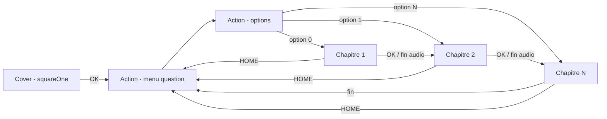
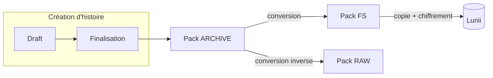

# Documentation technique — Format des livres (packs)

> Vue d'ensemble du format de livre (« pack ») : composition, nœuds, assets, formats de stockage et stockage sur l'appareil Lunii.

---

## Métadonnées

- **Statut** : Actif
- **Dernière mise à jour** : 2026-08-21
- **Liens** : [Création d'histoires](../story-creation-flow.md) · [Moteur TTS](../tts-engine.md)

---

## 1. Qu'est-ce qu'un « livre » ?

Un livre (ou **pack**) est un **graphe d'histoire** joué sur la Lunii :

- des **nœuds de scène** (`stageNode`) : une page = une image affichée + un audio joué + des touches actives.
- des **nœuds de choix** (`actionNode`) : une liste ordonnée d'options vers des pages.
- des **transitions** (`okTransition`, `homeTransition`) qui relient les pages aux points de choix.

Le premier `stageNode` du graphe est la **page d'accueil** (`squareOne`) : son UUID est aussi l'**identifiant du pack**.

## 2. Les trois formats de pack

| | **Archive (studio)** | **RAW (binaire)** | **FS (folder / lunii)** |
|---|---|---|---|
| Conteneur | ZIP (`story.json` + `assets/`) | Flux binaire adressé par secteurs | Arborescence de fichiers |
| Constante format | `"archive"` | `"raw"` | `"fs"` |
| Image | PNG / JPEG / BMP | BMP | BMP 320×240 4-bpp **RLE4** |
| Audio | MP3 / OGG / WAV | WAV PCM 16-bit mono 32 kHz | MP3 mono 44,1 kHz **sans ID3** |
| Métadonnées enrichies | ✅ | ⚠️ optionnel | ⛔ perdues |
| Usage | Échange, bibliothèque, éditeur | Appareils firmware 1.x | Appareils firmware 2.x/3.x |

## 3. Documents détaillés

| Doc | Contenu |
|---|---|
| [`pack-model.md`](pack-model.md) | Les nœuds : types, champs, options, transitions, types éditeur |
| [`audio.md`](audio.md) | L'audio d'une node : format, compression, conversions |
| [`images.md`](images.md) | L'image d'une node : format, compression RLE4, conversions |
| [`studio-archive-format.md`](studio-archive-format.md) | **Format archive (studio)** — le zip échangeable |
| [`lunii-folder-format.md`](lunii-folder-format.md) | **Format lunii (folder/FS)** — le dossier de l'appareil |
| [`device-storage.md`](device-storage.md) | **Stockage sur la Lunii** : layout disque, index, chiffrement |

## 4. Cycle de vie

## 5. Invariants transverses

1. **Identité du pack** = UUID du premier `stageNode` (`squareOne`).
2. **Déduplication des assets par SHA-1** du contenu.
3. **`controlSettings` est requis** sur chaque page.
4. **Chaque page doit avoir un `okTransition` valide** (sinon « error card »).
5. **Le graphe est reconstruit à la lecture** : l'ordre des `stageNodes` est significatif.
6. **Little-endian** partout dans les formats binaires (sauf mention contraire).

## 6. Références code

| Rôle | Emplacement |
|---|---|
| Modèle mémoire | `pack/format/model/` (`StoryPack.kt`, `Transition.kt`, `Asset.kt`, `Constants.kt`) |
| Readers / Writers | `pack/format/reader/` + `pack/format/writer/` |
| Conversions assets | `pack/format/utils/` (`AudioConversion`, `ImageConversion`, `PackAssetsCompression`) |
| Convertisseur de formats | `pack/adapter/StudioCorePackFormatConverterAdapter.kt` |
| Drivers appareil | `device/driver/` (`LuniiUsb`, `RawStoryTellerDriver`, `FsStoryTellerDriver`, `FsCipher`) |
