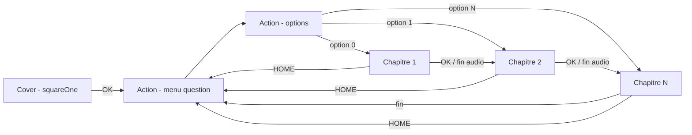
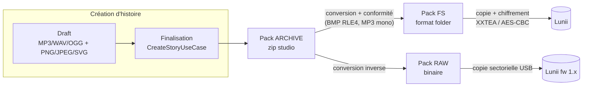

# Documentation technique — Format des livres (packs)

> Documentation technique du **format de livre** (« pack ») dans StoryUnchained : composition,
> nœuds, assets (audio / image), les trois formats de stockage et le stockage sur l'appareil Lunii.

---

## 1. Qu'est-ce qu'un « livre » ?

Un livre (ou **pack**) est un **graphe d'histoire** joué sur la Lunii :

- des **nœuds de scène** (`stageNode`) : une page = une image affichée + un audio joué + des touches actives ;
- des **nœuds de choix** (`actionNode`) : une liste ordonnée d'options vers des pages ;
- des **transitions** (`okTransition`, `homeTransition`) qui relient les pages aux points de choix.

Le premier `stageNode` du graphe est la **page d'accueil** (`squareOne`) : son UUID est aussi
l'**identifiant du pack**.

Chaque page porte **au plus une image** et **au plus un audio** — la composition des assets est
détaillée dans des docs dédiés :

| Doc | Contenu |
|---|---|
| [`pack-model.md`](pack-model.md) | Les nœuds : types, champs, options, transitions, types éditeur |
| [`audio.md`](audio.md) | L'audio d'une node : format, compression, conversions |
| [`images.md`](images.md) | L'image d'une node : format, compression RLE4, conversions |
| [`studio-archive-format.md`](studio-archive-format.md) | **Format archive (studio)** — le zip échangeable |
| [`lunii-folder-format.md`](lunii-folder-format.md) | **Format lunii (folder/FS)** — le dossier de l'appareil |
| [`device-storage.md`](device-storage.md) | **Stockage sur la Lunii** : layout disque, index, chiffrement |

---

## 2. Les trois formats de pack

Un même livre existe sous trois représentations, portées par un modèle mémoire unique
(`StoryPack`, `StageNode`, `ActionNode`, `Transition`) :

| | **Archive (studio)** | **RAW (binaire)** | **FS (folder / lunii)** |
|---|---|---|---|
| Conteneur | ZIP (`story.json` + `assets/`) | Flux binaire adressé par secteurs | Arborescence de fichiers |
| Constante format | `"archive"` | `"raw"` | `"fs"` |
| Image | PNG / JPEG / BMP | BMP | BMP 320×240 4-bpp **RLE4** |
| Audio | MP3 / OGG / WAV | WAV PCM 16-bit mono 32 kHz | MP3 mono 44,1 kHz **sans ID3** |
| Métadonnées enrichies | ✅ (`title`, `name`, `type`, `position`…) | ⚠️ optionnel (format enrichi) | ⛔ perdues |
| Usage | Échange, bibliothèque, éditeur | Appareils firmware 1.x (secteur brut) | Appareils firmware 2.x/3.x, disque monté |

- **Archive** — le format d'échange reverse-engineered par la communauté STUdio
  ([marian-m12l/studio](https://github.com/marian-m12l/studio)) : ce n'est **pas** un format
  officiel Lunii. StoryUnchained l'implémente en Kotlin pur. → [`studio-archive-format.md`](studio-archive-format.md)
- **FS (« folder »)** — le format **stocké sur l'appareil** : un dossier par pack, index binaires
  `ni`/`li`/`ri`/`si`, assets dans `rf/` et `sf/`. → [`lunii-folder-format.md`](lunii-folder-format.md)
- **RAW** — le format historique des premières Lunii : un flux binaire plat lu/écrit secteur par
  secteur (512 octets) directement sur la flash/SD. Même modèle logique (nœuds, index), mais
  adressage par secteur.

---

## 3. Cycle de vie d'un livre dans StoryUnchained

Conversions (`StudioCorePackFormatConverterAdapter`, `PackAssetsCompression`) :

| Conversion | Images | Audio |
|---|---|---|
| RAW → ARCHIVE | BMP → PNG | WAV → OGG (fallback WAV : encodage OGG indisponible) |
| ARCHIVE → RAW | PNG/JPEG → BMP | OGG/MP3 → WAV (PCM 32 kHz) |
| ARCHIVE/RAW → FS | → BMP 320×240 4-bpp RLE4 | → MP3 mono 44,1 kHz sans tag ID3 |
| FS → ARCHIVE | BMP RLE4 Lunii → PNG (illisibles hors Lunii) | conservé |

Un pack converti est écrit dans le dossier bibliothèque sous
`{uuid}.converted_{timestamp}.{archive|pack}` (RAW) ou `{uuid}.converted_{timestamp}.zip` (archive).

---

## 4. Invariants transverses

Ces règles valent pour **tous** les formats :

1. **Identité du pack** = UUID du premier `stageNode` (`squareOne`). Aucun champ dédié.
2. **Déduplication des assets par SHA-1** du contenu : deux nœuds partageant le même fichier
   pointent vers la même entrée (hash de nommage en archive, même index en FS/RAW).
3. **`controlSettings` est requis** sur chaque page : sans lui, le lecteur lève une erreur.
4. **Chaque page doit avoir un `okTransition` valide** — une page avec OK indéfini (`-1` en FS)
   déclenche une *error card* sur la Lunii.
5. **Le graphe est reconstruit à la lecture** : l'ordre des `stageNodes` est significatif
   (index 0 = `squareOne`), et l'ordre des `options` d'un `actionNode` = l'ordre de la molette.
6. **Little-endian** partout dans les formats binaires (ni/li/ri/si, RAW), sauf mention contraire
   (clés XXTEA en big-endian, UUID de l'index device en big-endian).

---

## 5. Références de code

| Rôle | Emplacement |
|---|---|
| Modèle mémoire | `api/src/main/kotlin/com/maxlass/studio/pack/format/model/` (`StoryPack.kt`, `Transition.kt`, `Asset.kt`, `Constants.kt`) |
| Readers / Writers | `pack/format/reader/` + `pack/format/writer/` (Archive, Fs, Binary) |
| Conversions assets | `pack/format/utils/` (`AudioConversion`, `ImageConversion`, `PackAssetsCompression`) |
| Convertisseur de formats | `pack/adapter/StudioCorePackFormatConverterAdapter.kt` |
| Drivers appareil | `device/driver/` (`LuniiUsb`, `RawStoryTellerDriver`, `FsStoryTellerDriver`, `FsCipher`) |
| Docs associées | `doc/story-creation-flow.md` (création), `doc/tts-engine.md` / `tts-settings.md` (synthèse vocale) |
