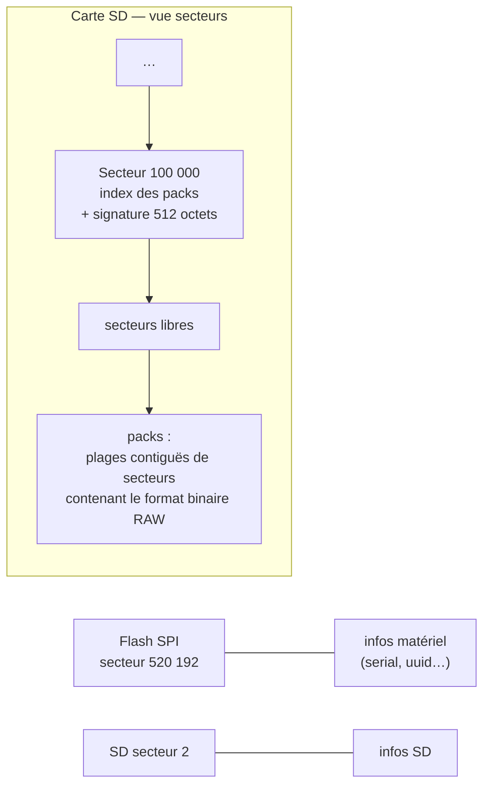
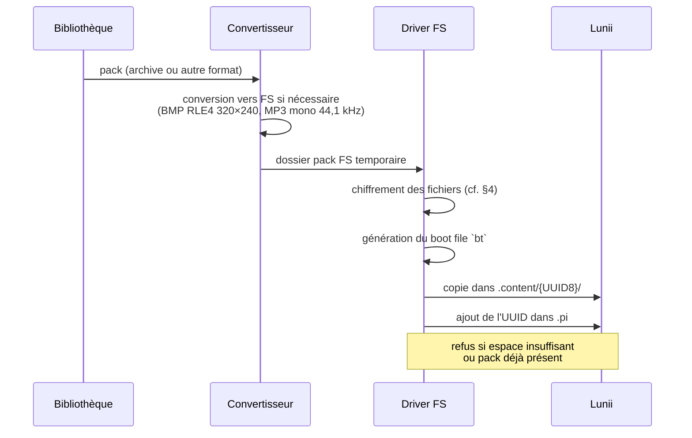
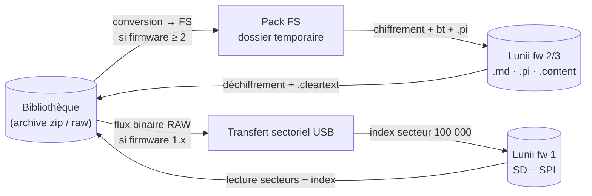

# Stockage sur la Lunii

> Comment les packs sont réellement **stockés sur l'appareil Lunii** : détection USB, layout du
> disque pour les deux générations d'appareils (firmware 1.x « RAW » et firmware 2.x/3.x « FS »),
> index des packs et chiffrement. Le **contenu** d'un pack folder est décrit dans
> [`lunii-folder-format.md`](lunii-folder-format.md).

---

## 1. Deux générations d'appareils

| | **RAW** (firmware 1.x) | **FS** (firmware 2.x / 3.x) |
|---|---|---|
| USB VID:PID | `0x0c45:0x6820` (FW1) | `0x0c45:0x6840` (FW2) · `0x0483:0xa341` (V2) |
| Accès | **Sectoriel** : lecture/écriture directe de secteurs de 512 octets via USB | **Système de fichiers** : l'appareil apparaît comme un volume monté (clé USB) |
| Format des packs | Binaire RAW (§3) | Format « folder » (§4) — cf. [`lunii-folder-format.md`](lunii-folder-format.md) |
| Index des packs | Liste de secteurs sur la SD + signature | Fichier `.pi` à la racine |

Détection : `LuniiUsb` (libusb) écoute les événements hotplug (ou sonde activement si le hotplug
n'est pas disponible) et route vers le driver correspondant (`RawStoryTellerDriver` /
`FsStoryTellerDriver`) via `DriverDeviceConnector`.

---

## 2. Appareil RAW (firmware 1.x) — accès sectoriel

L'appareil expose deux mémoires adressables par **secteurs de 512 octets** (`UsbMassStorage`,
transferts bulk SCSI-like : CBW → data → CSW) :

- **flash SPI** — infos matériel ;
- **carte SD** — données (packs, index).



### Index des packs

- **Adresse fixe : secteur 100 000** (`PackConstants.PACKS_LIST_SECTOR`).
- Contient la liste des packs : UUID (16 octets, **big-endian**), version, **secteur de début**,
  **taille en secteurs**, offsets stats/échantillonnage (`RawStoryPackInfos`).
- Terminé par la **signature de 512 octets** `PackConstants.CHECK_BYTES` — valider le secteur
  d'index. Un nouveau pack est écrit sur la **première plage libre assez grande**
  (`findFirstSuitableSector`), puis l'index est réécrit.
- Transfert : **chunks de 5 000 secteurs** (2,5 Mo) — `uploadPack`/`downloadPack`.
- Capacité SD de référence : 6 815 513 secteurs (dont partition FAT16 de 20 480).

### Contenu d'un pack RAW

Chaque pack est un flux binaire plat **adressé par secteurs** — écrit/lit par
`BinaryStoryPackWriter`/`BinaryStoryPackReader` : entête (1 secteur : nb de pages, version,
`factoryDisabled`), un secteur par page (UUID, adresses assets, transitions, touches), secteurs
des `actionNode`s (options = shorts), puis les assets (BMP/WAV, paddés à 512 octets), terminé
par la signature `CHECK_BYTES`. Format **non chiffré**, assets WAV/BMP natifs.

---

## 3. Appareil FS (firmware 2.x / 3.x) — volume monté

L'appareil monte une partition ; le driver l'identifie par la présence d'un fichier **`.md`** à
la racine (polling au branchement, 15 tentatives / 1 s). Layout de la partition :

```
/mount/lunii/
├── .md          ← métadonnées de l'appareil (binaire, §3.1)
├── .pi          ← index des packs : liste d'UUID (§3.2)
└── .content/    ← un dossier par pack
    └── {UUID8}/ ← pack au format « folder » (ni, li, ri, si, rf/, sf/, nm, .cleartext, bt)
```

### 3.1 `.md` — métadonnées de l'appareil (binaire, little-endian)

Le premier champ (offset 0, `short` LE) est la **version** des métadonnées ; seules les versions
**1–3** et **6–7** sont supportées.

| Version | Firmware | Contenu clé |
|---|---|---|
| 1–3 | 2.x | firmware major/minor (offsets 4/6), serial (offset 8, big-endian, 14 chiffres), **UUID device** (256 octets à l'offset 254) |
| 6–7 | 3.x | firmware (ASCII, offsets 2/4), serial (24 octets à l'offset 26), **matériel de chiffrement** : clé AES + IV + `bt` (voir [`device-storage.md`](#4-chiffrement-des-fichiers) ci-dessous), dérivés du serial |

C'est aussi via ce fichier que le driver lit l'espace disque (`totalSpace`/`freeSpace`).

### 3.2 `.pi` — l'index des packs

Suite d'**UUID de 16 octets en big-endian** (high puis low), un par pack installé. Toute
modification (copie, suppression) réécrit le fichier **atomiquement** (`.pi.new` → move).
L'ordre de l'index = l'ordre d'affichage des packs sur l'appareil.

### 3.3 Copie d'un pack vers l'appareil



La suppression fait l'inverse : retrait de l'UUID de `.pi`, puis suppression du dossier
(avec retries). Le téléchargement (appareil → bibliothèque) déchiffre les fichiers et ajoute un
marqueur `.cleartext` à la copie locale.

---

## 4. Chiffrement des fichiers

Sur un appareil FS, **seuls certains fichiers sont chiffrés** à la copie vers l'appareil —
`FsCipher` :

| Fichier | Traitement |
|---|---|
| `ni`, `nm`, `.cleartext` | **jamais chiffrés** (`CLEAR_FILES`) |
| `.cleartext` | **jamais copié** sur l'appareil (`NO_COPY_FILES`) |
| `li`, `ri`, `si`, `rf/*`, `sf/*` | **chiffrés** sur le premier bloc de 512 octets |

| Firmware | Algorithme | Clé |
|---|---|---|
| 2.x | **XXTEA** (`XxteaCipher.btea`) — bloc 512 octets (128 mots, little-endian) | **clé commune** (partagée par les appareils, embarquée) |
| 3.x | **AES-CBC NoPadding** — bloc 512 octets (paddé à un multiple de 16) | **clé + IV spécifiques à l'appareil** (lues dans `.md` v6/v7) |

### Boot file `bt`

- **Firmware 2** : `bt` = chiffrement (XXTEA, bloc 64 octets, **clé spécifique dérivée de
  l'UUID device** — permutation d'octets de l'UUID déchiffré) des **64 premiers octets du `ri`**
  du pack. C'est le « tampon » que le firmware vérifie au démarrage du pack.
- **Firmware 3** : `bt` = valeur lue directement dans `.md` (32 octets, dérivée du serial).

> Conséquence : un pack sans `bt` cohérent n'est **pas lu par l'appareil** — c'est pourquoi le
> driver régénère `bt` à chaque copie, et pourquoi un pack **téléchargé** d'un appareil puis
> copié vers un autre reçoit le `bt` du nouvel appareil.

---

## 5. Cycle complet — bibliothèque ↔ appareil



Erreurs remontées par l'API : `DEVICE_NOT_PLUGGED` (409), `FORMAT_INCOMPATIBLE` (400),
`PACK_ALREADY_ON_DEVICE` (400), `PACK_NOT_FOUND` (404), espace insuffisant.

---

## 6. Références de code

| Élément | Fichier |
|---|---|
| Détection USB / hotplug | `device/driver/LuniiUsb.kt` (`FW1/FW2/V2` VID:PID) |
| Accès sectoriel USB | `device/driver/UsbMassStorage.kt` (`readSpiSectors`, `readSdSectors`, `writeSdSectors`) |
| Driver RAW | `device/driver/RawStoryTellerDriver.kt` (index, secteurs, transferts) |
| Driver FS | `device/driver/FsStoryTellerDriver.kt` (`.md`, `.pi`, `.content`, copie) |
| Chiffrement / boot file | `device/driver/FsCipher.kt` · `pack/format/utils/XxteaCipher.kt` |
| Constantes (secteurs, signature) | `pack/format/model/Constants.kt` (`PACKS_LIST_SECTOR`, `CHECK_BYTES`, `SECTOR_SIZE`) |
| Orchestration appareil | `device/adapter/DriverDeviceConnector.kt` |
