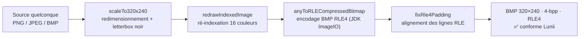

# L'image d'une node — formats et compression

> Chaque `stageNode` porte **au plus une image** (champ `image`), affichée sur l'écran 320×240 de
> la Lunii à l'entrée dans la page. Ce doc décrit le fichier selon le format de pack : conteneurs
> acceptés, compression réellement appliquée (notamment le BMP 4-bpp RLE4 du format appareil) et
> conversions. Le modèle des nœuds est dans [`pack-model.md`](pack-model.md).

---

## 1. Résumé par format de pack

| | **Archive (studio)** | **RAW (binaire)** | **FS (folder / lunii)** |
|---|---|---|---|
| Fichiers acceptés | `.png`, `.jpg`/`.jpeg`, `.bmp` | BMP uniquement | BMP 4-bpp **RLE4** uniquement |
| Dimensions | libres | libres | **320 × 240** (requis) |
| Profondeur | libre | libre | **4 bits = 16 couleurs** (palette) |
| Compression | PNG/JPEG native ou BMP | BMP | **RLE4** (BI_RLE4 = type 2) |
| MIME | déduit de l'**extension** | `image/bmp` | `image/bmp` |
| Nommage | `{sha1-hex}{ext}` dans `assets/` | adressé par secteur | `rf/000\{index:08}` + index `ri` |
| Page sans image | `image: null` (écran inchangé) | asset `-1` | asset `-1` |

---

## 2. Format FS — le BMP « Lunii » en détail

Le format folder (appareil, firmware ≥ 2) n'accepte **que** des BMP conformes. Le writer valide
l'en-tête BMP de chaque asset (`FsStoryPackWriter.requireIsRle4Bmp`) — lecture little-endian :

| Offset | Champ BMP | Valeur exigée | Signification |
|---:|---|---:|---|
| 18 | `biWidth` | `320` | Largeur en pixels |
| 22 | `biHeight` | `240` | Hauteur en pixels |
| 28 | `biBitCount` | `4` | 4 bits/pixel → **palette de 16 couleurs** |
| 30 | `biCompression` | `2` | `BI_RLE4` : compression **RLE 4 bits** |

> Un BMP qui ne passe pas ces quatre vérifications est **rejeté** (« FS pack file requires image
> assets to use 4-bit depth and RLE encoding » / « …to be 320x240 pixels »).

### La chaîne de conformité appliquée par StoryUnchained

Conversion ARCHIVE/RAW → FS (`StudioCorePackFormatConverterAdapter.conformFsImages`) :

Étapes (`ImageConversion`) :

1. **`scaleTo320x240`** — dessine la source sur un canvas 320×240 (fond **noir**), proportion
   conservée, centré (letterbox).
2. **`redrawIndexedImage`** — ré-indexe l'image sur une **palette 16 couleurs** (l'écran de la
   Lunii est limité à 16 couleurs simultanées).
3. **`anyToRLECompressedBitmap`** — encode en BMP avec compression `BI_RLE4` explicite
   (JDK ImageWriter, `compressionType = "RLE4"`).
4. **`fixRle4Padding`** — corrige le padding des lignes RLE4 (les lignes doivent être alignées).

Un asset **déjà conforme** est conservé tel quel (vérification avant conversion).

---

## 3. Format archive — images « lisibles »

Le zip STUdio stocke des images que des viewers standard savent ouvrir :

| Extension | MIME |
|---|---|
| `.png` | `image/png` |
| `.jpg` / `.jpeg` | `image/jpeg` |
| `.bmp` | `image/bmp` |

- Le format est déduit de l'**extension** à la lecture (pas de MIME dans `story.json`).
- Conversion RAW → ARCHIVE : BMP → **PNG** (`ImageConversion.bitmapToPng`).
- Conversion FS → ARCHIVE : BMP 4-bpp RLE4 Lunii → **PNG** — indispensable car un BMP RLE4
  produit pour la Lunii **n'est pas ouvrable** par un viewer standard.

---

## 4. Format RAW — BMP « brut »

Le binaire RAW (firmware 1.x) stocke les images en BMP (`image/bmp` requis par
`BinaryStoryPackWriter`) sans contrainte de dimensions : PNG/JPEG d'entrée passent par
`ImageConversion.anyToBitmap` (`PackAssetsCompression.withUncompressedAssets`).
Un BMP **déjà** RLE4 Lunii (issue d'un pack FS) est re-encodé vers BMP « standard ».

---

## 5. Dimensions, palette et rendu à l'écran

- L'écran de la Lunii affiche **320 × 240**. En FS, c'est une contrainte forte : toute image est
  recalée exactement à cette taille.
- **16 couleurs** maximum simultanées (4 bits) : la ré-indexation peut réduire la fidélité des
  dégradés — c'est la limite matérielle de l'appareil.
- Letterbox **noir** : une source non 4:3 (ex. carrée, 16:9) est centrée avec bandes noires
  haut/bas ou gauche/droite.
- Pages sans image : l'écran **conserve l'image de la page précédente** (utile pour les pages
  « audio seul » d'un chapitre).

Pour la génération d'images de chapitres (numéros, icônes) : voir `doc/chapter-image-generator.md`.

---

## 6. Matrice de conversion

| De ↓ vers → | ARCHIVE | RAW (BMP) | FS (BMP RLE4) |
|---|---|---|---|
| **ARCHIVE** (PNG/JPEG/BMP) | — | `anyToBitmap` | scale 320×240 → palette 16 → RLE4 |
| **RAW** (BMP) | `bitmapToPng` | — | scale 320×240 → palette 16 → RLE4 |
| **FS** (BMP RLE4) | `anyToRLECompressedBitmap` inverse → PNG (sinon illisible hors Lunii) | re-encodé BMP standard | — |

Règles transverses (identiques à l'audio) :

- **Déduplication par SHA-1** du contenu : même fichier → même entrée, plusieurs index.
- Conversion appliquée **une fois par asset unique**.

---

## 7. Où dans le code

| Élément | Fichier |
|---|---|
| Conversions image | `pack/format/utils/ImageConversion.kt` |
| Compression/décompression de pack | `pack/format/utils/PackAssetsCompression.kt` |
| Conformité FS (scale + RLE4) | `pack/adapter/StudioCorePackFormatConverterAdapter.kt` (`conformFsImages`, `scaleTo320x240`) |
| Validation FS (320×240, 4-bpp, RLE4) | `pack/format/writer/FsStoryPackWriter.kt` (`requireIsRle4Bmp`) |
