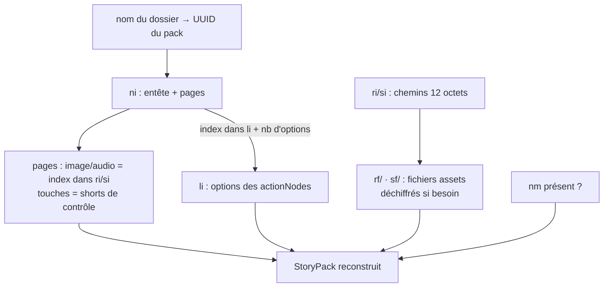

# Format LUNII « folder » (FS)

> Le format **dossier** : la représentation **stockée sur l'appareil Lunii** (firmware ≥ 2) et le
> format cible de la conversion avant copie. Un pack FS est une arborescence de fichiers avec des
> index binaires — c'est aussi la forme qu'on trouve **zippée** dans certaines bibliothèques
> (« FS embarqué dans un zip », détecté avant le format archive à la lecture).
>
> Modèle logique (nœuds, transitions) : [`pack-model.md`](pack-model.md) · Stockage sur l'appareil
> (layout disque, chiffrement) : [`device-storage.md`](device-storage.md).

---

## 1. Vue d'ensemble

| | |
|---|---|
| Constante format | `"fs"` |
| Conteneur | Dossier (ou zip contenant ce dossier) |
| Images | BMP **320×240 · 4-bpp · RLE4** ([`images.md`](images.md)) |
| Audio | MP3 **mono 44,1 kHz · sans ID3** ([`audio.md`](audio.md)) |
| UUID du pack | Dérivé du **nom du dossier** (8 derniers chiffres hex de l'UUID, majuscules) |
| Métadonnées enrichies | ⛔ Non stockées (`name`, `type`, `position`… perdues) |

Code : `FsStoryPackReader` / `FsStoryPackWriter` (`pack/format/`).

---

## 2. Arborescence d'un pack

```
{UUID8}/                      ← ex. "A1B2C3D4" (8 derniers hex de l'UUID du pack)
├── ni                        ← node index  : entête + 1 enregistrement par page   (binaire)
├── li                        ← list index  : options des points de choix           (binaire)
├── ri                        ← image index : noms des fichiers image               (binaire)
├── si                        ← sound index : noms des fichiers audio               (binaire)
├── rf/                       ← images ("ri files")
│   └── 000/00000000, 000/00000001, …
├── sf/                       ← sons ("si files")
│   └── 000/00000000, 000/00000001, …
├── nm                        ← marqueur vide : mode nuit disponible (si présent)
├── .cleartext                ← marqueur : fichiers en clair (pas chiffrés)
└── bt                        ← boot file (généré par le driver à la copie, cf. device-storage)
```

- Les noms `ni`/`li`/`ri`/`si`/`rf/`/`sf/` sont des constantes du format
  (`FsStoryPackWriter.Companion`).
- Les chemins d'assets utilisent le séparateur **antislash** `\` dans les index (`000\00000000`),
  converti en `/` pour accéder au fichier réel.

### UUID → nom de dossier

`transformUuid` : l'UUID du pack est mis en majuscules **sans tirets**, et on garde les
**8 derniers caractères** : `0123…-…-…89abcdef` → dossier `89ABCDEF`. Le reader fait l'inverse :
l'UUID du pack est reconstruit depuis le nom du dossier (`split(".", limit=2)[0]`).

---

## 3. `ni` — l'index des nœuds

Fichier binaire **little-endian**. Un **entête de 512 octets**, puis un enregistrement de
**44 octets par page**, dans l'ordre des pages.

### Entête (512 octets)

| Offset | Taille | Champ | Valeur / sens |
|---:|---:|---|---|
| 0 | 2 | début de liste | `1` (lu puis ignoré) |
| 2 | 2 | **version** du pack | `short` — lu comme version du format |
| 4 | 4 | offset de la liste des nœuds | `512` |
| 8 | 4 | taille d'un enregistrement | `44` |
| 12 | 4 | **nombre de pages** (`stageNodesCount`) | |
| 16 | 4 | nombre d'images (pages avec image ≠ null) | |
| 20 | 4 | nombre de sons (pages avec audio ≠ null) | |
| 24 | 1 | **`factoryDisabled`** | `1` = pack d'usine désactivé |
| 25 | 487 | padding | zéros |

### Enregistrement page (44 octets)

| Offset | Taille | Champ | `-1` si… |
|---:|---:|---|---|
| 0 | 4 | **index image dans `ri`** | pas d'image |
| 4 | 4 | **index audio dans `si`** | pas d'audio |
| 8 | 4 | `okTransition` — index dans `li` | |
| 12 | 4 | `okTransition` — nombre d'options | |
| 16 | 4 | `okTransition` — option choisie | pas de transition OK |
| 20 | 4 | `homeTransition` — index dans `li` | |
| 24 | 4 | `homeTransition` — nombre d'options | |
| 28 | 4 | `homeTransition` — option choisie | pas de transition HOME |
| 32 | 2 | `wheel` activé | |
| 34 | 2 | `ok` activé | |
| 36 | 2 | `home` activé | |
| 38 | 2 | `pause` activé | |
| 40 | 2 | `autoplay` activé | |
| 42 | 2 | réservé | zéro |

> ⚠️ **Une page sans `okTransition` valide** (champs à `-1`) provoque une **error card** sur la
> Lunii si l'histoire l'atteint. Les booléens de touches sont des shorts : `1` = activé, `0` = non.

---

## 4. `li` — l'index des points de choix

Liste **concaténée** d'options, lue comme des blocs de `int32` little-endian : chaque
`actionNode` référencé par une transition écrit **un entier par option** (index de page dans
l'ordre des pages de `ni`).

- L'**adresse** d'un `actionNode` dans `li` (en unités de 4 octets) est portée par les
  enregistrements `ni` (`okTransition`/`homeTransition` — index dans `li`).
- Le **nombre d'options** n'est pas stocké dans `li` : il vient des enregistrements `ni`
  (« nombre d'options ») ; le reader reconstruit chaque point de choix en lisant ce nombre
  d'entiers à l'adresse donnée.
- Un `actionNode` partagé par plusieurs transitions est écrit **une seule fois** ; l'ordre
  d'écriture = ordre de première référence par les pages (transition OK avant HOME).

```
li (int32 little-endian) :
[ option 0 | option 1 | … option k-1 ]  ← actionNode @adresse 0  (k = nb d'options lu dans ni)
[ option 0 | …        ]                 ← actionNode @adresse k
…
```

---

## 5. `ri` / `si` — les index d'assets + `rf/` / `sf/`

`ri` (images) et `si` (sons) sont des suites **d'entrées de 12 octets** : le chemin de l'asset
pour l'index *i* est `ri[i*12 .. i*12+12]`.

```
format d'un chemin (12 caractères) : "000\%08d"   ex. "000\00000000"
                                          └─ antislash littéral
```

- Le fichier correspondant : `rf/000/00000000` (images) ou `sf/000/00000000` (sons) —
  l'antislash du chemin devient un `/`.
- L'index d'un asset est **attribué à la première page qui le référence** ; le même asset
  (même SHA-1) référencé par plusieurs pages → **même index**, fichier stocké une fois.
- Les assets sont écrits **dans l'ordre de leurs index** : `000\00000000`, `000\00000001`, …

### Pages sans image / sans audio

| Champ | Archive | FS |
|---|---|---|
| Page sans image | `image: null` | index image = `-1` (aucun fichier `rf/`) |
| Page sans audio | `audio: null` | index audio = **-1 interdit** → un **MP3 blank** est inséré (`BlankMp3`) : l'appareil exige un asset sonore par entrée d'index |

---

## 6. `nm`, `.cleartext`, `bt`

| Fichier | Rôle |
|---|---|
| `nm` | Fichier **vide** : simple marqueur — « le pack supporte le mode nuit ». Présent ⇔ `nightModeAvailable`. |
| `.cleartext` | Marqueur : les index/fichiers du pack sont **en clair** (pas chiffrés). Sa présence court-circuite le déchiffrement à la lecture. Un pack sans marqueur mais dont `ri` commence par `000\` est réparé automatiquement (`isCleartext`). |
| `bt` | **Boot file** : **non écrit par le writer du pack** — il est généré par le **driver** lors de la copie vers l'appareil (dérivé des clés du device, cf. [`device-storage.md`](device-storage.md) §4). |

> Les fichiers du pack sont écrits **en clair** ; le chiffrement (XXTEA/AES sur le premier bloc
> de 512 octets) n'arrive qu'à la copie sur l'appareil — voir [`device-storage.md`](device-storage.md).

---

## 7. Lecture — reconstruction du graphe



Comportements notables du reader :

- **UUID du pack** = nom du dossier ; seule la **page 0** le porte — les autres pages reçoivent
  des UUID régénérés à la volée (identité locale).
- **`squareOne`** n'existe pas : la page d'accueil est **l'index 0**.
- **Métadonnées enrichies perdues** : `name`/`type`/`position` ne sont pas stockés → `enriched = null`.
- **Assets dédupliqués** : un fichier référencé par N pages n'est lu qu'une fois.
- **Version** : `short` à l'offset 2 de l'entête `ni`.

---

## 8. Écriture — les règles du writer

`FsStoryPackWriter.write(pack, outputFolder)` :

1. Crée le dossier `{UUID8}` ; écrit `nm` si `nightModeAvailable` et **`.cleartext`**.
2. Valide les assets : image **BMP RLE4 320×240** (§`images.md`), audio **MP3 mono 44,1 kHz sans
   ID3** (§`audio.md`) — sinon `require` en erreur.
3. Insère un **MP3 blank** pour chaque page sans audio.
4. Numérote assets et `actionNode`s dans l'ordre de première référence ; déduplique par SHA-1.
5. Écrit `ni` (entête 512 + 44 octets/page), puis `li`, `ri`/`rf/`, `si`/`sf/`.

> Prérequis : un pack archive doit passer par la **conversion** (`StudioCorePackFormatConverterAdapter`)
> qui applique les conformités image/audio **avant** l'écriture FS.

---

## 9. Détection et lecture des « FS zippés »

Certaines bibliothèques stockent un pack FS **zippé** (racine = dossier `{UUID8}` contenant
`ni`/`li`/`ri`). `PackFileInspector` teste **d'abord** ce cas (`detectFsInsideZip`) : un zip dont
la racine contient un dossier à nom UUID avec `ni`/`li`/`ri` est lu comme pack FS après
dézippage temporaire — avant d'être considéré comme archive (qui exige `story.json` + `assets/`).

---

## 10. Références de code

| Élément | Fichier |
|---|---|
| Lecture / écriture | `pack/format/reader/FsStoryPackReader.kt` · `pack/format/writer/FsStoryPackWriter.kt` |
| Constantes fichiers | `FsStoryPackWriter.Companion` (`ni`, `li`, `ri`, `si`, `rf/`, `sf/`, `bt`, `nm`, `.cleartext`) |
| Copie/chiffrement appareil | `device/driver/FsStoryTellerDriver.kt` · `device/driver/FsCipher.kt` → [`device-storage.md`](device-storage.md) |
| Conformité assets | `pack/format/utils/ImageConversion.kt` · `AudioConversion.kt` |
