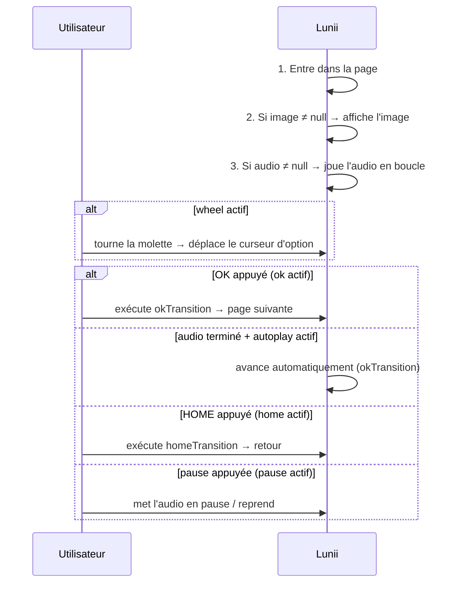
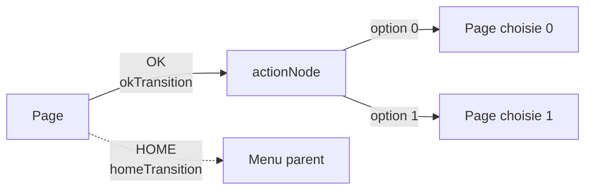
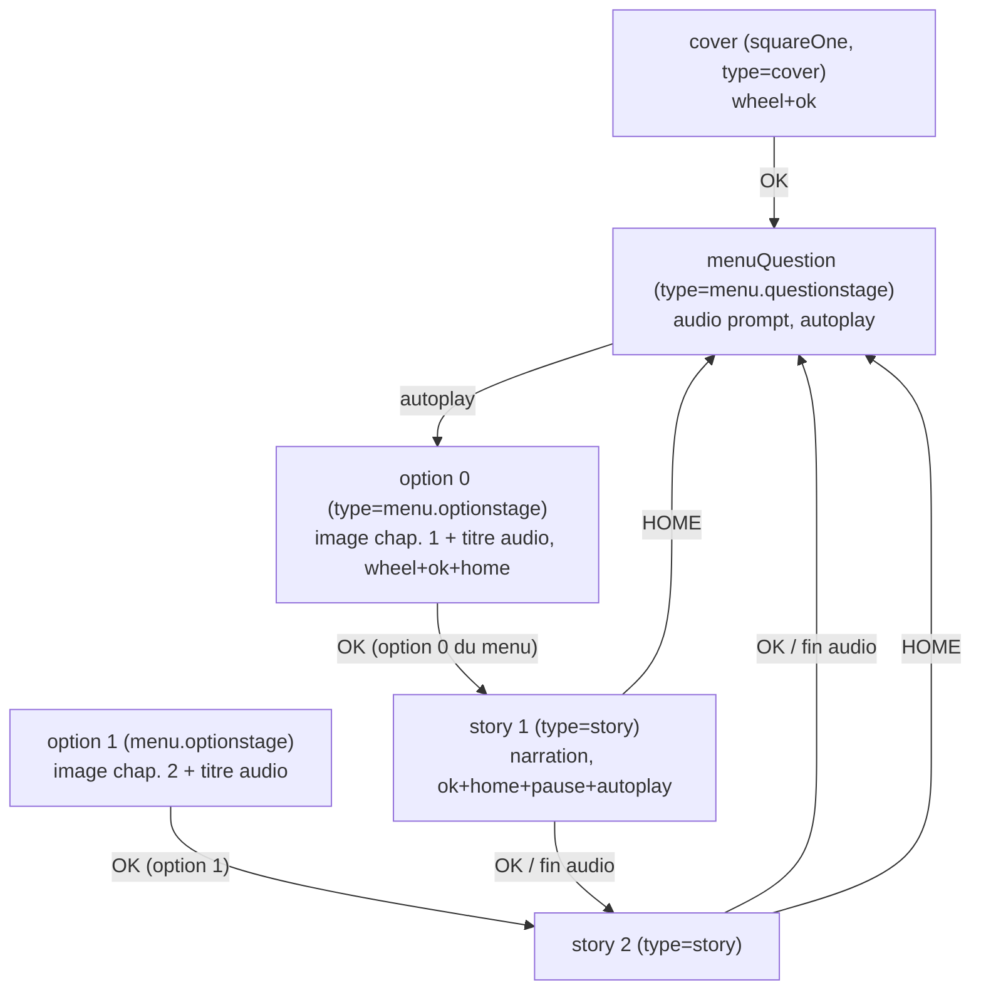

# Les nœuds — types, champs et options

> Référence des **nœuds** composant un livre : chaque type, chaque champ, chaque option et ce
> qu'ils produisent réellement sur la Lunii. Le modèle décrit ici est le **modèle mémoire**
> commun aux trois formats de pack (voir [`README.md`](README.md)) — seuls les conteneurs
> changent ([archive](studio-archive-format.md), [folder](lunii-folder-format.md), RAW).

---

## 1. Le modèle : un graphe à deux sortes de nœuds

```
┌─────────────────────────────┐        ┌──────────────────────────────┐
│  stageNode — la PAGE        │        │  actionNode — le CHOIX       │
│                             │        │                              │
│  uuid                       │        │  id / position dans le graphe│
│  image   (0 ou 1 asset)     │        │  options : liste ordonnée    │
│  audio   (0 ou 1 asset)     │        │    de stageNodes             │
│  okTransition               │◄──────►│  (ni image, ni audio)        │
│  homeTransition             │        │                              │
│  controlSettings (touches)  │        └──────────────────────────────┘
└─────────────────────────────┘
```

- **`stageNode`** — une **page** : une image affichée, un audio joué, des touches actives.
- **`actionNode`** — un **point de choix** : invisible (ni image ni audio), il porte une liste
  d'options vers des pages. L'`optionIndex` d'une transition qui y arrive **désigne déjà**
  l'option choisie : le nœud lui-même ne « fait » rien à l'exécution.

Code : `pack/format/model/StoryPack.kt` (`StageNode`, `ActionNode`), `Transition.kt`, `Asset.kt`.

---

## 2. `stageNode` — la page

| Champ | Type | Description |
|---|---|---|
| `uuid` | string | Identifiant unique de la page, référencé par les `actionNode.options`. Le **premier** nœud (`squareOne`) donne son UUID au pack. |
| `image` | `ImageAsset?` | Image affichée à l'entrée dans la page (0 ou 1 asset — voir [`images.md`](images.md)). |
| `audio` | `AudioAsset?` | Audio joué à l'entrée dans la page (0 ou 1 asset — voir [`audio.md`](audio.md)). |
| `okTransition` | `Transition?` | Destination de la touche **OK** (§4). Doit être valide sur chaque page. |
| `homeTransition` | `Transition?` | Destination de la touche **HOME** (§4). `null` = HOME sans effet de graphe. |
| `controlSettings` | `ControlSettings` | Touches actives sur la page (§3). **Requis.** |
| `enriched` | `EnrichedNodeMetadata?` | Métadonnées **éditeur** (§5) : `name`, `type`, `groupId`, `position`. Ignorées par la Lunii. |

### Déroulé d'une page sur la Lunii



- Image `null` → l'écran **conserve l'image précédente** (page « audio seul »).
- Audio `null` → silence. En format **FS**, une page sans audio reçoit un MP3 vide (blank)
  à l'écriture — l'appareil exige un asset sonore par index (voir [`lunii-folder-format.md`](lunii-folder-format.md) §3).

---

## 3. `controlSettings` — les touches actives

| Option | Type | Rôle |
|---|---|---|
| `wheel` | bool | **Molette** : déplace le curseur entre les options d'un menu. |
| `ok` | bool | **OK** : exécute `okTransition`. `ok=false` + `autoplay=true` = page qui avance seule. |
| `home` | bool | **HOME** : exécute `homeTransition` (retour menu/parent). |
| `pause` | bool | **Pause** : met l'audio en pause / reprend. |
| `autoplay` | bool | **Saut automatique** : à la fin de l'audio, exécute `okTransition` sans appui. |

### Configurations types

| Page | wheel | ok | home | pause | autoplay |
|---|:-:|:-:|:-:|:-:|:-:|
| **Cover** (accueil du pack) | ✅ | ✅ | ⛔ | ⛔ | ⛔ |
| **Menu / sélection** (choisir puis valider) | ✅ | ✅ | ✅ | ⛔ | ⛔ |
| **Option de menu** (image + titre du chapitre) | ✅ | ✅ | ✅ | ⛔ | ⛔ |
| **Question de menu** (prompt audio, avance seule) | ⛔ | ⛔ | ⛔ | ⛔ | ✅ |
| **Histoire / chapitre** (narration) | ⛔ | ✅ | ✅ | ✅ | ✅ |

> ⚠️ `controlSettings` est **obligatoire** : le lecteur archive lève une
> `IllegalStateException` si le champ manque (`controlSettings` requis).

---

## 4. Les transitions

Une transition relie une page à **une option précise** d'un point de choix :

| Champ | Type | Description |
|---|---|---|
| `actionNode` | ref | Le point de choix cible. |
| `optionIndex` | short | Index de l'option sélectionnée dans `actionNode.options` (0-based). |

| Transition | Rôle | Analogie |
|---|---|---|
| `okTransition` | **Avancer** : page suivante, valider un choix, continuer le récit. | « Suivant » |
| `homeTransition` | **Reculer / sortir** : retourner au menu, au parent, à l'accueil. | « Retour » |



Règles importantes :

- **OK = avant, HOME = arrière** — les deux ne sont jamais redondants.
- Sur une histoire linéaire, chaque chapitre pointe vers le suivant ; le **dernier chapitre
  reboucle** vers le menu (ou la cover).
- ⚠️ **Une page sans `okTransition` valide** (absente, ou `optionIndex = -1` après conversion FS)
  provoque une **error card** sur la Lunii quand l'histoire l'atteint.
- Avec `autoplay=true`, la fin de l'audio déclenche la même transition qu'OK : OK et
  « fin d'audio » avancent au même endroit.

---

## 5. `actionNode` — le point de choix

| Champ | Type | Description |
|---|---|---|
| `options` | `List<StageNode>` | Les pages proposées. **L'ordre = l'ordre de la molette** ; `optionIndex` d'une transition sélectionne l'une d'elles. |
| `enriched` | `EnrichedNodeMetadata?` | Métadonnées éditeur (§6). |

- Le point de choix **n'a ni image ni audio** : pure structure de navigation.
- Un même `actionNode` peut être partagé par plusieurs transitions (un menu central vu depuis
  plusieurs pages) : dans les formats binaires il est écrit **une seule fois**, référencé par index.
- En archive, son `id` est **local au zip** (généré par le writer) ; en FS/RAW il est adressé par
  index/secteur.

---

## 6. Types éditeur (`type`) et métadonnées enrichies

Ces champs sont **ignorés par la Lunii** (pas d'effet sur la lecture) : ils servent aux outils
(éditeur, statistiques, exports). Ils sont portés par `EnrichedNodeMetadata` et ne survivent à la
conversion FS que s'ils sont re-créés (le format folder ne les stocke pas).

| Champ | Contenu |
|---|---|
| `name` | Nom lisible du nœud (titre de chapitre, menu…). |
| `type` | Type éditeur (table ci-dessous). |
| `groupId` | Regroupement visuel dans l'éditeur. |
| `position {x,y}` | Position sur le canvas de l'éditeur. |

| `type` (chaîne) | Code | Rôle |
|---|:-:|---|
| `stage` | 1 | Page générique (menu, intro, transition). |
| `action` | 2 | Point de choix générique. |
| `cover` | 17 | **Page de couverture** (le `squareOne`). |
| `menu.questionaction` | 33 | Point de choix d'une question de menu. |
| `menu.questionstage` | 34 | Page de question de menu (prompt audio + avancement auto). |
| `menu.optionsaction` | 35 | Point de choix à options (menu chapitres). |
| `menu.optionstage` | 36 | Page d'option de menu (image + titre audio du chapitre). |
| `story` | 49 | **Page d'histoire** (un chapitre). |
| `story.storyaction` | 50 | Point de choix dans une histoire (ramification). |

---

## 7. Structures d'histoire types

### Pack à menu (le modèle Lunii classique)



- La **cover** affiche l'image du livre et joue son titre ; OK ouvre le menu.
- La **question de menu** joue son prompt puis avance seule (autoplay).
- Chaque **option** est une page distincte : le menu « lit » le titre de chaque chapitre pendant
  que la molette parcourt les options.
- Le **chapitre** joue la narration seule (le titre n'est pas relu) ; OK **ou** la fin de l'audio
  avance au suivant ; le dernier chapitre reboucle vers le menu.

### Histoire linéaire sans menu

```
cover (squareOne) ──OK──► chapitre 1 ──OK/autoplay──► chapitre 2 ──…──► dernier
    ▲                                                                      │
    └────────────────────── rebouclage (OK / fin d'audio) ◄────────────────┘
```

Chapitres : image du chapitre + narration en audio ; le dernier reboucle sur la cover.

---

## 8. Où dans le code

| Élément | Fichier |
|---|---|
| Modèle (`StageNode`, `ActionNode`, `Transition`, `ControlSettings`, `EnrichedNodeMetadata`, `EnrichedNodeType`) | `pack/format/model/` |
| Écriture / lecture archive | `pack/format/writer/ArchiveStoryPackWriter.kt` · `pack/format/reader/ArchiveStoryPackReader.kt` |
| Écriture / lecture FS (folder) | `pack/format/writer/FsStoryPackWriter.kt` · `pack/format/reader/FsStoryPackReader.kt` |
| Écriture / lecture RAW (binaire) | `pack/format/writer/BinaryStoryPackWriter.kt` · `pack/format/reader/BinaryStoryPackReader.kt` |
| Création d'histoires (finalisation) | `pack/service/CreateStoryUseCase.kt` — voir `doc/story-creation-flow.md` |
