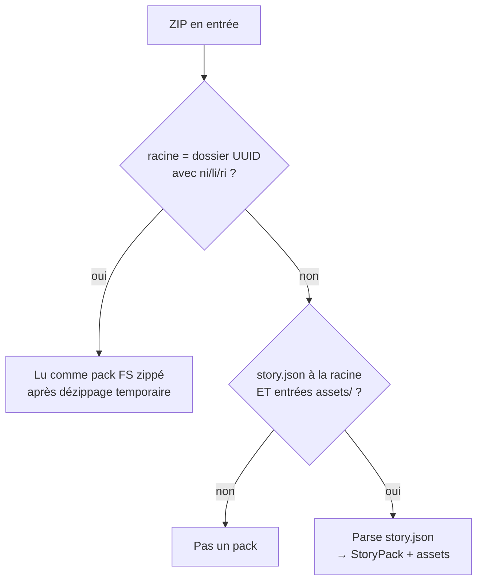

# Format ARCHIVE « studio » (zip)

> Le format **archive** : un **zip standard** contenant un `story.json` (le graphe de l'histoire,
> lisible par un humain) et les assets. C'est le format d'échange reverse-engineered par la
> communauté STUdio ([marian-m12l/studio](https://github.com/marian-m12l/studio), `studio-core`) —
> **pas** un format publié officiellement par Lunii. StoryUnchained l'implémente en Kotlin pur.
>
> Modèle logique (nœuds, transitions) : [`pack-model.md`](pack-model.md) · Format appareil :
> [`lunii-folder-format.md`](lunii-folder-format.md).

---

## 1. Vue d'ensemble

| | |
|---|---|
| Constante format | `"archive"` |
| Conteneur | ZIP (`story.json` **et** entrées `assets/…` requis) |
| Images | `.png` / `.jpg` / `.jpeg` / `.bmp` |
| Audio | `.mp3` / `.ogg` / `.oga` / `.wav` |
| UUID du pack | Dérivé du **premier `stageNode`** (`squareOne`) — aucun champ dédié |
| Métadonnées enrichies | ✅ conservées (title, description, champs étendus, name/type/position des nœuds) |

Code : `ArchiveStoryPackReader` / `ArchiveStoryPackWriter` (`pack/format/`).

### Structure du zip

```
pack.zip
├── story.json               ← graphe de l'histoire (JSON pretty-print)
├── assets/
│   ├── {sha1}.png           ← image du cover
│   ├── {sha1}.mp3           ← audio du cover
│   ├── {sha1}.png           ← image du chapitre 1 (nom = SHA-1 du contenu)
│   └── {sha1}.mp3           ← …
├── meta/thumbnail.png       ← vignette (écrite par StoryUnchained à l'update des métadonnées)
└── thumbnail.png            ← vignette héritée (ancien emplacement, lu en fallback)
```

> Un zip **sans** `story.json` n'est pas reconnu comme pack (le reader retourne `null`).
> Un zip **sans** dossier `assets/` non plus (`PackFileInspector.looksLikeArchiveZip` exige les deux).
> **Précédence** : un zip dont la racine contient un dossier à nom UUID avec `ni`/`li`/`ri` est
> d'abord testé comme **pack FS zippé** — cf. [`lunii-folder-format.md`](lunii-folder-format.md) §9.

---

## 2. `story.json`

```json
{
  "format": "v1",
  "title": "Mon Histoire",
  "description": "Une jolie histoire",
  "version": 1,
  "nightModeAvailable": true,
  "locale": "fr_FR",
  "ageMin": 3,
  "ageMax": 7,
  "durationMs": 1250000,
  "storyCount": 5,
  "stageNodes": [ … ],
  "actionNodes": [ … ]
}
```

| Champ | Type | Description |
|---|---|---|
| `format` | string | Version du format, toujours `"v1"` |
| `title` | string | Titre du pack (métadonnées, pas affiché sur la Lunii). Fallback writer : `MISSING_PACK_TITLE` |
| `description` | string? | Description (optionnel) |
| `version` | int | Version interne du format |
| `nightModeAvailable` | bool | Mode nuit disponible → crée le marqueur `nm` à la conversion FS |
| `locale` | string? | **Extension StoryUnchained** — langue (`fr_FR`…) |
| `ageMin` / `ageMax` | int? | **Extension** — âge conseillé |
| `durationMs` | int? | **Extension** — durée totale en ms |
| `storyCount` | int? | **Extension** — nombre d'histoires du pack |
| `stageNodes` | array | Les pages (§3) |
| `actionNodes` | array | Les points de choix (§4) |

> Les champs étendus (`locale`…`storyCount`) sont absents des packs STUdio bruts ; StoryUnchained
> les lit et les écrit (`MetaDataReaderAdapter`, `UpdateZipMetadataAdapter`). Les formats RAW/FS
> ne les portent pas (ils restent `null` en bibliothèque).

---

## 3. `stageNodes` — les pages

```json
{
  "uuid": "a1b2c3d4-e5f6-7890-abcd-ef1234567890",
  "name": "Chapitre 1",
  "type": "story",
  "groupId": "grp-1",
  "position": { "x": 0, "y": 0 },
  "squareOne": true,
  "image": "e8f2a1c9….png",
  "audio": "3b7d9e10….mp3",
  "okTransition": { "actionNode": "uuid-action-node", "optionIndex": 0 },
  "homeTransition": null,
  "controlSettings": { "wheel": true, "ok": true, "home": false, "pause": true, "autoplay": false }
}
```

| Champ | Type | Description |
|---|---|---|
| `uuid` | string | Identifiant unique de la page (référencé par les `actionNode.options`) |
| `squareOne` | bool | `true` **uniquement sur le premier nœud** — page d'accueil du pack, écrite par le writer sur l'index 0 |
| `image` / `audio` | string? | Noms de fichiers dans `assets/` (`null` = aucun asset) |
| `okTransition` / `homeTransition` | object? | Transitions (§5) |
| `controlSettings` | object | Touches actives — **requis** (le reader lève une erreur sinon) |
| `name` / `type` / `groupId` / `position` | – | Métadonnées **éditeur** (cf. [`pack-model.md`](pack-model.md) §6), relues sans être exigées |

Les rôles sémantiques (touches, autoplay, types éditeur et leurs codes) sont détaillés dans
[`pack-model.md`](pack-model.md) — ils sont identiques dans les trois formats.

## 4. `actionNodes` — les points de choix

```json
{
  "id": "uuid-action-node",
  "name": "Menu chapitres",
  "type": "menu.optionsaction",
  "options": ["a1b2c3d4-…", "f2g3h4i5-…"]
}
```

| Champ | Type | Description |
|---|---|---|
| `id` | string | Identifiant **local au zip**, référencé par les transitions. Généré par le writer (`UUID.randomUUID()`) si absent en mémoire — un même `ActionNode` partagé par deux transitions reçoit le même `id` |
| `options` | array\<string\> | UUID des pages proposées — **l'ordre = l'ordre de la molette** |

Le point de choix **n'a ni image ni audio** : pure structure de navigation.

## 5. Transitions

```json
{ "actionNode": "uuid-action-node", "optionIndex": 0 }
```

| Champ | Type | Description |
|---|---|---|
| `actionNode` | string | `id` de l'`actionNode` cible |
| `optionIndex` | int | Index de l'option sélectionnée dans `options` (0-based) |

---

## 6. Assets (`assets/`)

Les fichiers sont nommés par le **SHA-1 hexadécimal de leur contenu + extension** :

- déduplication automatique : deux pages partageant le même fichier pointent vers **la même entrée** ;
- ordre d'écriture dans le zip = ordre **lexicographique** des noms (`sortedMapOf`), avec une
  entrée répertoire `assets/` explicite ;
- le **format d'un asset est déduit de son extension** à la lecture — pas de MIME dans `story.json`.

| Extension | MIME associé à l'écriture |
|---|---|
| `.bmp` | `image/bmp` |
| `.png` | `image/png` |
| `.jpg` / `.jpeg` | `image/jpeg` |
| `.wav` | `audio/x-wav` |
| `.mp3` | `audio/mpeg` |
| `.ogg` / `.oga` | `audio/ogg` (lecture seule — pas d'encodage OGG dans le projet) |

Autre MIME → extension vide à l'écriture. Formats/compressions réels : [`audio.md`](audio.md) ·
[`images.md`](images.md).

---

## 7. Vignette (`thumbnail`)

| Emplacement | Écrit par | Lu par |
|---|---|---|
| `meta/thumbnail.png` | `UpdateZipMetadataAdapter` (update métadonnées depuis le front) | sync de bibliothèque (préférence) |
| `thumbnail.png` (racine) | packs produits par les outils STUdio / anciens | fallback sync **et** `readMetadata` |

Le writer du pack **n'écrit pas** de vignette : elle est injectée lors de l'update des
métadonnées (`PATCH /packs/{id}/metadata` / `PATCH /packs/{id}/thumbnail`), flux qui recopie
toutes les entrées du zip à l'identique, ne modifie que `story.json` (champs étendus) et la
vignette, et écrit **atomiquement** (fichier temp + `ATOMIC_MOVE`).

---

## 8. Lecture — comportements notables



- **`squareOne` prioritaire** : même si un autre nœud apparaît en premier dans le tableau, le
  nœud marqué `squareOne` est repositionné en tête (c'est lui qui définit l'UUID du pack).
- **Assets partagés** : un même fichier référencé par N pages n'est chargé qu'une fois en mémoire.
- **`controlSettings` requis** : page sans → `IllegalStateException`.
- **Métadonnées allégées** : `readMetadata` (sync) ne lit que `story.json` + la vignette racine,
  **sans dézipper les assets**.

## 9. Écriture — comportements notables

- **JSON kotlinx.serialization** avec `prettyPrint = true` (pas gson).
- **`squareOne: true` auto** sur le nœud d'index 0 → l'ordre de `stageNodes` est significatif.
- Fallbacks : `title` absent → `MISSING_PACK_TITLE`, `name` absent → `MISSING_NAME`,
  assets/transitions absents → `null` explicite.
- **`controlSettings` toujours écrit** (défauts `false` si absent en mémoire).

---

## 10. Exemple complet minimal

```json
{
  "format": "v1",
  "title": "Mon Histoire",
  "description": "Une description",
  "version": 1,
  "nightModeAvailable": true,
  "actionNodes": [
    { "id": "action-1", "options": ["stage-2"] }
  ],
  "stageNodes": [
    {
      "uuid": "stage-1",
      "squareOne": true,
      "name": "Cover",
      "type": "cover",
      "image": "img.bmp",
      "audio": "a.mp3",
      "okTransition": { "actionNode": "action-1", "optionIndex": 0 },
      "controlSettings": { "wheel": true, "ok": true, "home": false, "pause": true, "autoplay": false }
    },
    {
      "uuid": "stage-2",
      "name": "Chapitre 1",
      "type": "story",
      "controlSettings": { "wheel": true, "ok": true, "home": true, "pause": true, "autoplay": false }
    }
  ]
}
```

Zip correspondant : `story.json`, `assets/img.bmp`, `assets/a.mp3`.

> Un pack archive reste **jouable sur la Lunii** seulement après conversion FS : images → BMP
> 320×240 4-bpp RLE4, audio → MP3 mono 44,1 kHz sans ID3 (cf. [`images.md`](images.md) /
> [`audio.md`](audio.md)).

---

## 11. Limites connues (différences vs `studio-core`)

- **Encodage OGG non supporté** (`waveToOgg` → `UnsupportedOperationException`) : les conversions
  RAW → ARCHIVE conservent du WAV.
- **Encodages disponibles** : MP3 (jump3r/LAME) et BMP/PNG (JDK ImageIO).
- **Identité par UUID de nœuds** : deux packs partageant le même premier `stageNode.uuid` sont
  traités comme le même pack par le sync (fingerprint), même si leurs fichiers diffèrent.

---

## 12. Références de code

| Élément | Fichier |
|---|---|
| Écriture / lecture zip | `pack/format/writer/ArchiveStoryPackWriter.kt` · `pack/format/reader/ArchiveStoryPackReader.kt` |
| Détection | `PackFileInspector` (`looksLikeArchiveZip`, `detectFsInsideZip`) |
| Vignette | `pack/util/ZipThumbnailEntry.kt` (`findThumbnailEntry`) · `pack/adapter/UpdateZipMetadataAdapter.kt` |
| Métadonnées fichier → bibliothèque | `pack/adapter/MetaDataReaderAdapter.kt` · `pack/service/PackMetaExtractor.kt` |
| Conversions | `pack/adapter/StudioCorePackFormatConverterAdapter.kt` · `pack/format/utils/PackAssetsCompression.kt` |
